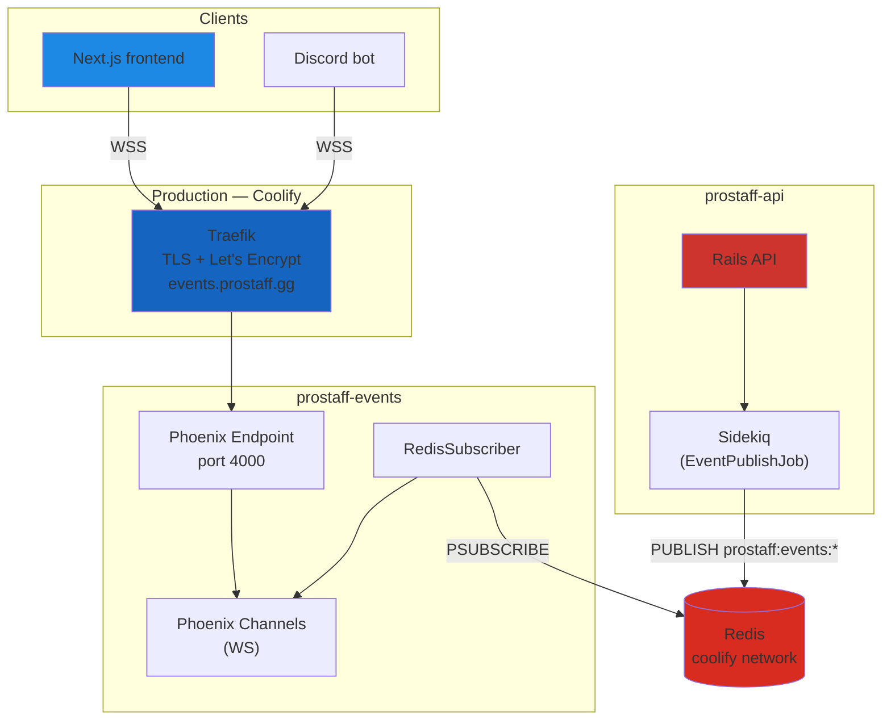

```
>        ███████╗██╗   ██╗███████╗███╗   ██╗████████╗███████╗
>        ██╔════╝██║   ██║██╔════╝████╗  ██║╚══██╔══╝██╔════╝
>        █████╗  ██║   ██║█████╗  ██╔██╗ ██║   ██║   ███████╗
>        ██╔══╝  ╚██╗ ██╔╝██╔══╝  ██║╚██╗██║   ██║   ╚════██║
>        ███████╗ ╚████╔╝ ███████╗██║ ╚████║   ██║   ███████║
>        ╚══════╝  ╚═══╝  ╚══════╝╚═╝  ╚═══╝   ╚═╝   ╚══════╝
              prostaff-events — Real-time Event Bus & WebSocket Hub
```

<div align="center">

[](https://elixir-lang.org/)
[](https://phoenixframework.org/)
[](https://www.gnu.org/licenses/agpl-3.0)

</div>

---

```
╔══════════════════════════════════════════════════════════════════════════════╗
║  PROSTAFF EVENTS — Elixir / Phoenix 1.7                                      ║
╠══════════════════════════════════════════════════════════════════════════════╣
║  Real-time event bus for the ProStaff ecosystem.                             ║
║  Subscribes to Redis pub/sub from Rails and pushes events via WebSocket.     ║
╚══════════════════════════════════════════════════════════════════════════════╝
```

---

<details>
<summary><kbd>▶ Key Features (click to expand)</kbd></summary>

```
┌─────────────────────────────────────────────────────────────────────────────┐
│  [■] Phoenix Channels       — WebSocket delivery for all domain events      │
│  [■] Redis Pub/Sub          — PSUBSCRIBE prostaff:events:* from Rails API   │
│  [■] InhouseQueue GenServer — One GenServer per active queue (BEAM actor)   │
│  [■] Check-in Deadline      — Process.send_after timer, no cron needed      │
│  [■] Startup Reconciler     — Rebuilds GenServers from Rails API on boot    │
│  [■] JWT Auth               — User JWT + Internal JWT (service-to-service)  │
│  [■] Tenant Isolation       — org_id validated on every channel subscription│
│  [■] Scraper Webhook        — POST /events/notify via X-API-Key             │
│  [■] Health Endpoint        — GET /health for Coolify + Traefik probes      │
│  [■] Supervised Tree        — OTP supervisor restarts any crashed process   │
└─────────────────────────────────────────────────────────────────────────────┘
```

</details>

---

## Table of Contents

```
┌──────────────────────────────────────────────────────┐
│  01 · Quick Start                                    │
│  02 · Technology Stack                               │
│  03 · Architecture                                   │
│  04 · Setup                                          │
│  05 · WebSocket Channels                             │
│  06 · Domain Events                                  │
│  07 · Deployment                                     │
│  08 · Environment Variables                          │
└──────────────────────────────────────────────────────┘
```

---

## 01 · Quick Start

<details>
<summary><kbd>▶ Docker (Recommended)</kbd></summary>

```bash
# Start the events service (requires Redis running separately or via prostaff-api stack)
cp .env.example .env
# Edit .env — set REDIS_URL, INTERNAL_JWT_SECRET, SECRET_KEY_BASE

docker compose up -d

# Health check
curl http://localhost:4000/health
# {"status":"ok"}
```

</details>

<details>
<summary><kbd>▶ Local Development (Without Docker)</kbd></summary>

```bash
cp .env.example .env
# Edit .env

mix deps.get
mix phx.server
# Listening on http://localhost:4000
```

</details>

```
  Events WS:   ws://localhost:4000/socket
  Health:      http://localhost:4000/health
```

---

## 02 · Technology Stack

```
╔══════════════════════╦════════════════════════════════════════════════════╗
║  LAYER               ║  TECHNOLOGY                                        ║
╠══════════════════════╬════════════════════════════════════════════════════╣
║  Language            ║  Elixir 1.17                                       ║
║  Framework           ║  Phoenix 1.7                                       ║
║  Real-time           ║  Phoenix Channels (WebSocket)                      ║
║  Pub/Sub             ║  Phoenix.PubSub + Redix (Redis subscriber)         ║
║  State               ║  GenServer (one per active InhouseQueue)           ║
║  Auth                ║  Joken 2.6 (JWT verification)                      ║
║  Transport           ║  Redis pub/sub (channel: prostaff:events:{org_id}) ║
║  HTTP server         ║  Plug.Cowboy 2.7                                   ║
║  CORS                ║  Corsica 2.1                                       ║
╚══════════════════════╩════════════════════════════════════════════════════╝
```

---

## 03 · Architecture

```
┌─────────────────────────────────────────────────────────────────────────────┐
│                         prostaff-events                                     │
│                                                                             │
│   Rails API  ──publish──▶  Redis pub/sub  ──PSUBSCRIBE──▶  RedisSubscriber  │
│                           prostaff:events:*                       │         │
│                                                         ┌─────────┘         │
│                                                         ▼                   │
│                                               Phoenix.PubSub                │
│                                              /     |       \                │
│                                             ▼      ▼        ▼               │
│                                    Notif.   Tourn. Inhouse  InhouseQueue    │
│                                    Channel  Channel Channel  GenServer      │
│                                      │        │       │     (per queue)     │
│                                      └────────┴───────┘                     │
│                                              │                              │
│                                     Connected Clients                       │
│                                  (Next.js / Discord bot)                    │
└─────────────────────────────────────────────────────────────────────────────┘
```

### Supervision Tree

```mermaid
graph TD
    S[ProstaffEvents.Supervisor]
    S --> R[Registry — InhouseQueue.Registry]
    S --> PS[Phoenix.PubSub]
    S --> RS[RedisSubscriber — PSUBSCRIBE prostaff:events:*]
    S --> DS[InhouseQueue.Supervisor — DynamicSupervisor]
    S --> RC[InhouseQueue.Reconciler — fetches active queues on boot]
    S --> EP[ProstaffEventsWeb.Endpoint]
    DS --> GS1[InhouseQueue.Server org1:queue1]
    DS --> GS2[InhouseQueue.Server org2:queue2]

    style S fill:#4B275F
    style RS fill:#d82c20
    style DS fill:#4B275F
    style GS1 fill:#FF6B35
    style GS2 fill:#FF6B35
```



### Transport

Rails publishes to Redis via `EventPublishJob` (Sidekiq, queue `:events`, retry: 0):

```
channel format:  prostaff:events:{org_id}
envelope fields: id, type, user_id, org_id, payload, published_at
```

`RedisSubscriber` uses `PSUBSCRIBE prostaff:events:*` and routes by event type prefix
to the appropriate `Phoenix.PubSub` topic. Channels receive the broadcast and forward
to connected WebSocket clients.

---

## 04 · Setup

### Prerequisites

```
[✓] Elixir 1.17+
[✓] Redis 7+ (shared with Rails API)
[✓] prostaff-api running (for InhouseQueue.Reconciler)
```

### Installation

**1. Clone and install dependencies:**
```bash
git clone <repository-url>
cd prostaff-events
mix deps.get
```

**2. Configure environment:**
```bash
cp .env.example .env
# Edit .env — see Section 08 for all variables
```

**3. Start the service:**
```bash
mix phx.server
```

**4. Verify:**
```bash
curl http://localhost:4000/health
# {"status":"ok","redis":"connected","version":"0.1.0"}
```

---

## 05 · WebSocket Channels

### Connecting

```js
import { Socket } from "phoenix"

const socket = new Socket("wss://events.prostaff.gg/socket", {
  params: { token: "<user_jwt>" }
})
socket.connect()
```

### Available Channels

```
╔═══════════════════════════╦════════════════════╦═════════════════════════════╗
║  Topic                    ║  Subscriber        ║  Auth requirement           ║
╠═══════════════════════════╬════════════════════╬═════════════════════════════╣
║  notifications:{user_id}  ║  Logged-in users   ║  JWT — user_id must match   ║
║  tournament:{id}          ║  Any auth user     ║  JWT                        ║
║  inhouse:{org_id}         ║  Org members       ║  JWT — org_id must match    ║
╚═══════════════════════════╩════════════════════╩═════════════════════════════╝
```

### Usage Examples

```js
// Notifications
const notifChannel = socket.channel(`notifications:${userId}`)
notifChannel.join()
notifChannel.on("notification.created", ({ notification }) => {
  console.log(notification.title)
})

// Inhouse queue
const inhouseChannel = socket.channel(`inhouse:${orgId}`)
inhouseChannel.join()
inhouseChannel.on("queue_updated",    ({ queue }) => { ... })
inhouseChannel.on("check_in_expired", ({ queue }) => { ... })

// Tournament
const tournamentChannel = socket.channel(`tournament:${tournamentId}`)
tournamentChannel.join()
tournamentChannel.on("match_confirmed", ({ match }) => { ... })
```

---

## 06 · Domain Events

Events published by the Rails API and delivered to connected clients:

```
┌────────────────────────────────┬───────────────────────────────────────────┐
│  Event type                    │  Publisher (Rails)                        │
├────────────────────────────────┼───────────────────────────────────────────┤
│  inhouse.session_started       │  InhouseQueuesController#start_session    │
│  scrim_request.accepted        │  ScrimRequestsController#accept           │
│  scrim_request.declined        │  ScrimRequestsController#decline          │
│  tournament_match.confirmed    │  MatchConfirmationService#confirm_match!  │
│  tournament_match.walkover     │  TournamentWalkoverJob                    │
│  team_goal.completed           │  TeamGoal#mark_as_completed!              │
│  team_goal.progress_updated    │  TeamGoal#update_progress!                │
│  player.transferred            │  Admin::PlayersController#transfer        │
│  roster.player_removed         │  RosterManagementService                  │
│  roster.player_hired           │  RosterManagementService                  │
└────────────────────────────────┴───────────────────────────────────────────┘
```

### Scraper Webhook

The Python Scraper can push events directly without going through Redis:

```bash
POST /events/notify
X-Api-Key: <SCRAPER_API_KEY>
Content-Type: application/json

{ "type": "match.scraped", "org_id": "123", "payload": { ... } }
```

---

## 07 · Deployment

### Production Architecture (Coolify)



**Key points:**
- Both services share the same Redis instance via the `coolify` Docker network
- prostaff-events joins `coolify: external: true` — no separate Redis container
- Traefik handles TLS for `events.prostaff.gg` via Let's Encrypt
- Internal communication between services uses container names (e.g. `http://api:3000`)

### Coolify Panel — Required Env Vars

**For prostaff-events app:**

```bash
REDIS_URL=redis://default:<password>@redis:6379/0
INTERNAL_JWT_SECRET=<same value as prostaff-api>
SECRET_KEY_BASE=<64+ char random string — mix phx.gen.secret>
RAILS_API_URL=http://api:3000
PHX_HOST=events.prostaff.gg
SCRAPER_API_KEY=<optional>
```

**For prostaff-api app (add these two):**

```bash
PHOENIX_EVENTS_ENABLED=true
PHOENIX_EVENTS_URL=http://events:4000
```

> The container name `events` matches the service name in `docker-compose.yml`.
> Verify in the Coolify dashboard if Coolify overrides it.

---

## 08 · Environment Variables

```
╔════════════════════════╦══════════╦══════════════════════════════════════════╗
║  Variable              ║  Required║  Description                             ║
╠════════════════════════╬══════════╬══════════════════════════════════════════╣
║  REDIS_URL             ║  yes     ║  Shared Redis (same as Rails API)        ║
║  INTERNAL_JWT_SECRET   ║  yes     ║  Must match prostaff-api value           ║
║  SECRET_KEY_BASE       ║  yes     ║  Phoenix secret (min 64 chars)           ║
║  RAILS_API_URL         ║  yes     ║  Internal Rails URL (http://api:3000)    ║
║  PHX_HOST              ║  yes     ║  Public hostname (events.prostaff.gg)    ║
║  PORT                  ║  no      ║  HTTP port (default: 4000)               ║
║  SCRAPER_API_KEY       ║  no      ║  API key for POST /events/notify         ║
╚════════════════════════╩══════════╩══════════════════════════════════════════╝
```

Generate a `SECRET_KEY_BASE`:
```bash
mix phx.gen.secret
```

---

## License

```
╔══════════════════════════════════════════════════════════════════════════════╗
║  © 2026 ProStaff.gg. All rights reserved.                                    ║
║                                                                              ║
║  GNU Affero General Public License v3.0 (AGPLv3)                             ║
╚══════════════════════════════════════════════════════════════════════════════╝
```

[](https://www.gnu.org/licenses/agpl-3.0)

---

> Prostaff.gg isn't endorsed by Riot Games and doesn't reflect the views or opinions of Riot Games or anyone officially involved in producing or managing Riot Games properties.
>
> Riot Games, and all associated properties are trademarks or registered trademarks of Riot Games, Inc.

---

<div align="center">

```
▓▒░ · © 2026 PROSTAFF.GG · ░▒▓
```

</div>
