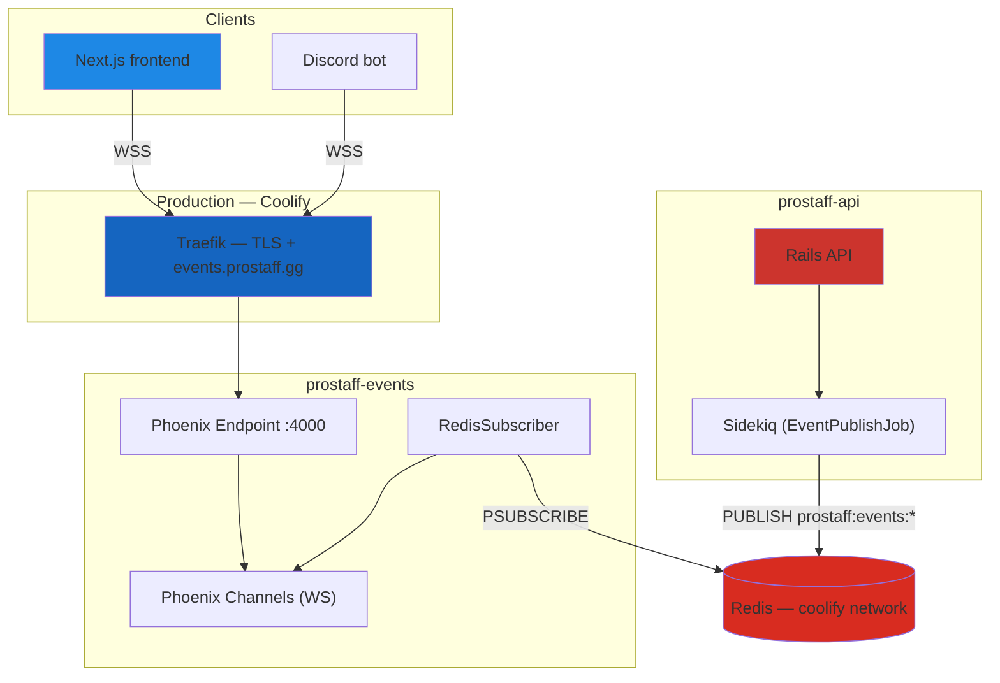

```
>            ███████╗██╗   ██╗███████╗███╗   ██╗████████╗███████╗
>            ██╔════╝██║   ██║██╔════╝████╗  ██║╚══██╔══╝██╔════╝
>            █████╗  ██║   ██║█████╗  ██╔██╗ ██║   ██║   ███████╗
>            ██╔══╝  ╚██╗ ██╔╝██╔══╝  ██║╚██╗██║   ██║   ╚════██║
>            ███████╗ ╚████╔╝ ███████╗██║ ╚████║   ██║   ███████║
>            ╚══════╝  ╚═══╝  ╚══════╝╚═╝  ╚═══╝   ╚═╝   ╚══════╝
              prostaff-events — Real-time Event Bus & WebSocket Hub
```

<div align="center">

[](https://elixir-lang.org/)
[](https://phoenixframework.org/)
[](https://github.com/bulletdev/prostaff-events/actions/workflows/ci.yml)
[](./)

</div>

---

```
╔══════════════════════════════════════════════════════════════════════════════╗
║  PROSTAFF EVENTS — Elixir / Phoenix 1.8                                      ║
╠══════════════════════════════════════════════════════════════════════════════╣
║  Real-time event bus for the ProStaff ecosystem.                             ║
║  Subscribes to Redis pub/sub from Rails and pushes events via WebSocket.     ║
╚══════════════════════════════════════════════════════════════════════════════╝
```

---

<details>
<summary><kbd>▶ Key Features (click to expand)</kbd></summary>

```
┌─────────────────────────────────────────────────────────────────────────────┐
│  REAL-TIME                                                                  │
│  [■] Phoenix Channels      — WebSocket delivery for all domain events       │
│  [■] Redis Pub/Sub         — PSUBSCRIBE prostaff:events:* from Rails API    │
│  [■] Schema Versioning     — version validated; unknown rejected, absent ok │
│                                                                             │
│  INHOUSE QUEUE                                                              │
│  [■] InhouseQueue GenServer — One BEAM actor per active queue               │
│  [■] Check-in Deadline      — Process.send_after timer, no cron needed      │
│  [■] Startup Reconciler     — Rebuilds GenServers from Rails API on boot    │
│  [■] Reconciler Backoff     — Retries 3× (1s / 2s / 4s) before giving up    │
│  [■] Rate Limiting          — 10 joins/min per org_id via ETS               │
│                                                                             │
│  SECURITY & OPS                                                             │
│  [■] JWT Auth               — User JWT + Internal JWT (service-to-service)  │
│  [■] Tenant Isolation       — org_id validated on every channel join        │
│  [■] Scraper Webhook        — POST /events/notify via X-API-Key             │
│  [■] Liveness Probe         — GET /health (no I/O, always fast)             │
│  [■] Readiness Probe        — GET /health/ready (checks Redis + Rails)      │
│  [■] Telemetry              — :prostaff.inhouse_queue.join/leave/checkin    │
│  [■] Non-root container     — Docker USER appuser                           │
│  [■] Force SSL              — HSTS + X-Forwarded-Proto via Traefik          │
└─────────────────────────────────────────────────────────────────────────────┘
```

</details>

---

## Table of Contents

```
┌──────────────────────────────────────────────────────┐
│  01 · Quick Start                                    │
│  02 · Technology Stack                               │
│  03 · Architecture                                   │
│  04 · Setup                                          │
│  05 · WebSocket Channels                             │
│  06 · Domain Events                                  │
│  07 · Testing & Quality                              │
│  08 · Deployment                                     │
│  09 · Environment Variables                          │
└──────────────────────────────────────────────────────┘
```

---

## 01 · Quick Start

<details>
<summary><kbd>▶ Docker (Recommended)</kbd></summary>

```bash
cp .env.example .env
# Edit .env - set REDIS_PASSWORD, INTERNAL_JWT_SECRET, SECRET_KEY_BASE

docker compose up -d

# Liveness
curl http://localhost:4000/health
# {"status":"ok","service":"prostaff-events","vsn":"0.1.0"}

# Readiness (checks Redis + Rails API)
curl http://localhost:4000/health/ready
# {"status":"ok","checks":{"redis":"ok","rails":"ok"}}
```

</details>

<details>
<summary><kbd>▶ Local Development (Without Docker)</kbd></summary>

```bash
cp .env.example .env

mix deps.get
mix phx.server
# Listening on http://localhost:4000
```

</details>

```
  Events WS:   ws://localhost:4000/socket
  Liveness:    http://localhost:4000/health
  Readiness:   http://localhost:4000/health/ready
```

---

## 02 · Technology Stack

```
╔══════════════════════╦════════════════════════════════════════════════════╗
║  LAYER               ║  TECHNOLOGY                                        ║
╠══════════════════════╬════════════════════════════════════════════════════╣
║  Language            ║  Elixir 1.17                                       ║
║  Framework           ║  Phoenix 1.8                                       ║
║  Real-time           ║  Phoenix Channels (WebSocket)                      ║
║  Pub/Sub             ║  Phoenix.PubSub + Redix (Redis subscriber)         ║
║  State               ║  GenServer (one per active InhouseQueue)           ║
║  Rate Limiting       ║  ETS — per org_id sliding window                   ║
║  Auth                ║  Joken 2.6 (JWT verification + manual exp check)   ║
║  Observability       ║  :telemetry + structured Logger metadata           ║
║  HTTP server         ║  Plug.Cowboy 2.7                                   ║
║  HTTP client         ║  Req 0.5 (Reconciler + Health checks)              ║
║  CORS                ║  Corsica 2.1                                       ║
╠══════════════════════╬════════════════════════════════════════════════════╣
║  TESTING             ║                                                    ║
║  Unit / Integration  ║  ExUnit + Phoenix.ChannelTest + ConnCase           ║
║  Mocking             ║  Mox (RailsClient behaviour)                       ║
║  Linter              ║  Credo --strict                                    ║
║  Security scanner    ║  Sobelow (Phoenix-specific) + Semgrep              ║
║  Type checker        ║  Dialyxir (Dialyzer wrapper)                       ║
╚══════════════════════╩════════════════════════════════════════════════════╝
```

---

## 03 · Architecture

```
┌─────────────────────────────────────────────────────────────────────────────┐
│                         prostaff-events                                     │
│                                                                             │
│   Rails API  ──publish──▶  Redis pub/sub  ──PSUBSCRIBE──▶  RedisSubscriber  │
│                           prostaff:events:*                       │         │
│                                                         ┌─────────┘         │
│                                                         ▼                   │
│                                               Phoenix.PubSub                │
│                                              /     |       \                │
│                                             ▼      ▼        ▼               │
│                                    Notif.   Tourn. Inhouse  InhouseQueue    │
│                                    Channel  Channel Channel  GenServer      │
│                                      │        │       │     (per queue)     │
│                                      └────────┴───────┘                     │
│                                              │                              │
│                                     Connected Clients                       │
│                                  (Next.js / Discord bot)                    │
└─────────────────────────────────────────────────────────────────────────────┘
```

### Supervision Tree

```mermaid
graph TD
    S[ProstaffEvents.Supervisor]
    S --> R[Registry — InhouseQueue.Registry]
    S --> PS[Phoenix.PubSub]
    S --> RL[RateLimit — ETS per org_id]
    S --> DS[InhouseQueue.Supervisor — DynamicSupervisor]
    S --> EP[ProstaffEventsWeb.Endpoint]
    S --> RX[Redix — :redix health connection]
    S --> RS[RedisSubscriber — PSUBSCRIBE prostaff:events:*]
    S --> RC[InhouseQueue.Reconciler — fetches active queues on boot]
    DS --> GS1[InhouseQueue.Server org1]
    DS --> GS2[InhouseQueue.Server org2]

    style S fill:#4B275F
    style RS fill:#d82c20
    style DS fill:#4B275F
    style GS1 fill:#FF6B35
    style GS2 fill:#FF6B35
    style RL fill:#2e7d32
```



### Transport & Schema

Rails publishes to Redis via `EventPublishJob` (Sidekiq, queue `:events`, retry: 0):

```
channel format:  prostaff:events:{org_id}
```

Event envelope:

```json
{
  "version":      "1",
  "id":           "uuid",
  "type":         "inhouse.session_started",
  "org_id":       "org-123",
  "user_id":      "user-456",
  "payload":      { ... },
  "published_at": "2026-06-08T00:00:00Z"
}
```

`RedisSubscriber` validates the `version` field — events with unknown versions are rejected before routing. Missing version is accepted for backward compatibility. Routing is done by `type` prefix:

```
notification.*     → notifications:{user_id}  +  org_events:{org_id}
tournament_match.* → tournament:{tournament_id}  +  org_events:{org_id}
inhouse.*          → inhouse:{org_id}  +  org_events:{org_id}
(all others)       → org_events:{org_id}
```

### Rate Limiting

`join_queue` channel events are rate-limited per `org_id` using an ETS sliding window:

```
default:  10 events / 60 seconds / org_id
response: {:error, %{reason: "rate_limited"}} on the channel reply
```

---

## 04 · Setup

### Prerequisites

```
[✓] Elixir 1.17+
[✓] Redis 7+ (shared with Rails API)
[✓] prostaff-api running (for InhouseQueue.Reconciler)
```

### Installation

**1. Clone and install dependencies:**
```bash
git clone <repository-url>
cd prostaff-events
mix deps.get
```

**2. Configure environment:**
```bash
cp .env.example .env
# Edit .env — see Section 09 for all variables
```

**3. Start the service:**
```bash
mix phx.server
```

**4. Verify:**
```bash
# Liveness (no I/O — always fast)
curl http://localhost:4000/health
# {"status":"ok","service":"prostaff-events","vsn":"0.1.0"}

# Readiness (checks Redis PING + Rails /health)
curl http://localhost:4000/health/ready
# {"status":"ok","checks":{"redis":"ok","rails":"ok"}}
# 503 + {"status":"unavailable","checks":{"redis":"...","rails":"..."}} if deps down
```

---

## 05 · WebSocket Channels

### Connecting

```js
import { Socket } from "phoenix"

const socket = new Socket("wss://events.prostaff.gg/socket", {
  params: { token: "<user_jwt>" }
})
socket.connect()
```

### Available Channels

```
╔═══════════════════════════╦════════════════════╦═════════════════════════════╗
║  Topic                    ║  Subscriber        ║  Auth requirement           ║
╠═══════════════════════════╬════════════════════╬═════════════════════════════╣
║  notifications:{user_id}  ║  Logged-in users   ║  JWT — user_id must match   ║
║  tournament:{id}          ║  Any auth user     ║  JWT                        ║
║  inhouse:{org_id}         ║  Org members       ║  JWT — org_id must match    ║
╚═══════════════════════════╩════════════════════╩═════════════════════════════╝
```

### Client Actions (inhouse channel)

```js
const ch = socket.channel(`inhouse:${orgId}`)
ch.join()

// Join the queue
ch.push("join_queue", { player_id: "player-1", role: "top" })
  .receive("ok",    state  => console.log("joined", state.player_count))
  .receive("error", err    => console.error(err.reason)) // "queue_not_open" | "rate_limited"

// Confirm presence during check-in
ch.push("checkin", { player_id: "player-1" })
  .receive("ok",    state => console.log("checked in"))
  .receive("error", err   => console.error(err.reason))

// Server-pushed events
ch.on("queue_update", ({ event, player_count }) => { ... })
```

### Usage Examples

```js
// Notifications
const notifChannel = socket.channel(`notifications:${userId}`)
notifChannel.join()
notifChannel.on("notification.created", ({ notification }) => {
  console.log(notification.title)
})

// Tournament
const tournamentChannel = socket.channel(`tournament:${tournamentId}`)
tournamentChannel.join()
tournamentChannel.on("match_confirmed", ({ match }) => { ... })
```

---

## 06 · Domain Events

Events published by the Rails API and delivered to connected clients:

```
┌────────────────────────────────┬───────────────────────────────────────────┐
│  Event type                    │  Publisher (Rails)                        │
├────────────────────────────────┼───────────────────────────────────────────┤
│  inhouse.session_started       │  InhouseQueuesController#start_session    │
│  scrim_request.accepted        │  ScrimRequestsController#accept           │
│  scrim_request.declined        │  ScrimRequestsController#decline          │
│  tournament_match.confirmed    │  MatchConfirmationService#confirm_match!  │
│  tournament_match.walkover     │  TournamentWalkoverJob                    │
│  team_goal.completed           │  TeamGoal#mark_as_completed!              │
│  team_goal.progress_updated    │  TeamGoal#update_progress!                │
│  player.transferred            │  Admin::PlayersController#transfer        │
│  roster.player_removed         │  RosterManagementService                  │
│  roster.player_hired           │  RosterManagementService                  │
└────────────────────────────────┴───────────────────────────────────────────┘
```

### Scraper Webhook

The Python Scraper can push events directly without going through Redis:

```bash
POST /events/notify
X-Api-Key: <SCRAPER_API_KEY>
Content-Type: application/json

{ "type": "match.scraped", "org_id": "123", "payload": { ... } }
```

---

## 07 · Testing & Quality

```bash
# Run the full test suite (44 tests)
mix test

# Linter — style, complexity, best practices
mix credo --strict

# Security scanner (Phoenix-specific: XSS, SQLi, CSRF, secrets exposure)
mix sobelow --config

# Static analysis / type checking
mix dialyzer

# Semgrep (CLI — runs without mix)
semgrep --config auto
```

```
╔════════════════╦════════════════════════════════════════════════════════════╗
║  Tool          ║  Coverage                                                  ║
╠════════════════╬════════════════════════════════════════════════════════════╣
║  ExUnit        ║  Unit (Auth, RedisSubscriber routing, InhouseQueue.Server) ║
║                ║  Integration (Reconciler + Mox, Channel, Controller)       ║
║  Mox           ║  RailsClient behaviour — process-safe expectations         ║
║  Credo         ║  Code style, nesting depth, unused vars, readability       ║
║  Sobelow       ║  Phoenix XSS, SQLi, CSRF, hardcoded secrets, config audit  ║
║  Semgrep       ║  Dockerfile security, language-level patterns              ║
║  Dialyxir      ║  Type inference via Erlang Dialyzer — catches bad specs    ║
╚════════════════╩════════════════════════════════════════════════════════════╝
```

---

## 08 · Deployment

### Production Architecture (Coolify)



**Key points:**
- Both services share the same Redis instance via the `coolify` Docker network
- prostaff-events joins `coolify: external: true` — no separate Redis container
- Traefik handles TLS for `events.prostaff.gg` via Let's Encrypt
- Phoenix uses `force_ssl` with `rewrite_on: [:x_forwarded_proto]` — HSTS enforced
- Container runs as non-root user (`appuser`) for reduced attack surface
- Internal communication uses container names (e.g. `http://api:3000`)

### Coolify Panel — Required Env Vars

**For prostaff-events app:**

```bash
REDIS_PASSWORD=<same password already set in prostaff-api>
INTERNAL_JWT_SECRET=<same value as prostaff-api>
SECRET_KEY_BASE=<64+ char random string — mix phx.gen.secret>
# RAILS_API_URL and PHX_HOST have sane defaults, override if needed
```

**For prostaff-api app (add these two):**

```bash
PHOENIX_EVENTS_ENABLED=true
PHOENIX_EVENTS_URL=http://events:4000
```

> The container name `events` matches the service name in `docker-compose.yml`.
> Verify in the Coolify dashboard if Coolify overrides it.

---

## 09 · Environment Variables

```
╔════════════════════════╦══════════╦══════════════════════════════════════════╗
║  Variable              ║  Required║  Description                             ║
╠════════════════════════╬══════════╬══════════════════════════════════════════╣
║  REDIS_PASSWORD        ║  yes*    ║  Docker/Coolify: compose builds          ║
║                        ║          ║  REDIS_URL from this                     ║
║  REDIS_URL             ║  yes*    ║  Local dev (no Docker): full URL,        ║
║                        ║          ║  e.g. redis://localhost:6379/0           ║
║  INTERNAL_JWT_SECRET   ║  yes     ║  Must match prostaff-api value           ║
║  SECRET_KEY_BASE       ║  yes     ║  Phoenix secret (min 64 chars)           ║
║  RAILS_API_URL         ║  no      ║  Internal Rails URL (default: api:3000)  ║
║  PHX_HOST              ║  no      ║  Public hostname (default: events.p.gg)  ║
║  PORT                  ║  no      ║  HTTP port (default: 4000)               ║
║  SCRAPER_API_KEY       ║  no      ║  API key for POST /events/notify         ║
╚════════════════════════╩══════════╩══════════════════════════════════════════╝
* Docker/Coolify: set REDIS_PASSWORD. Local dev without Docker: set REDIS_URL.
```

Generate a `SECRET_KEY_BASE`:
```bash
mix phx.gen.secret
```

---
<div align="center">

## License

```
╔══════════════════════════════════════════════════════════════════════════════╗
║  © 2026 ProStaff.gg. All rights reserved.                                    ║
║  Proprietary software — unauthorized use, copy or distribution prohibited.   ║
╚══════════════════════════════════════════════════════════════════════════════╝
```

---

> Prostaff.gg isn't endorsed by Riot Games and doesn't reflect the views or opinions of Riot Games or anyone officially involved in producing or managing Riot Games properties.
>
> Riot Games, and all associated properties are trademarks or registered trademarks of Riot Games, Inc.

---


```
▓▒░ · © 2026 PROSTAFF.GG · ░▒▓
```

</div>
